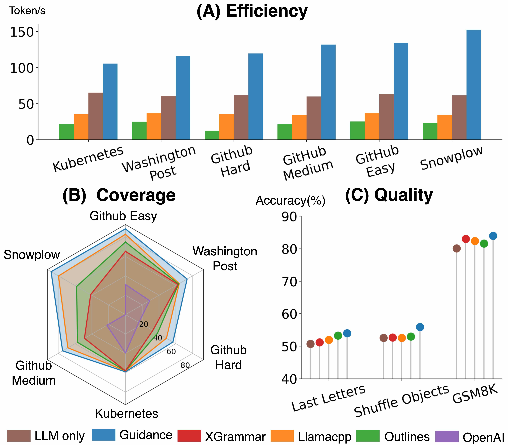
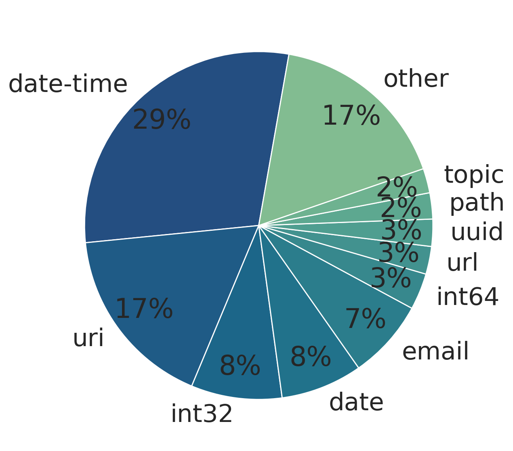
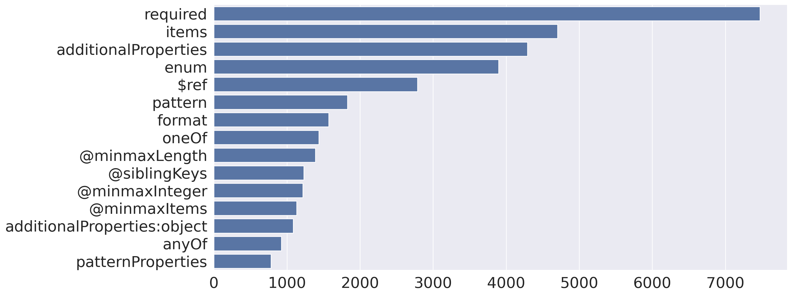
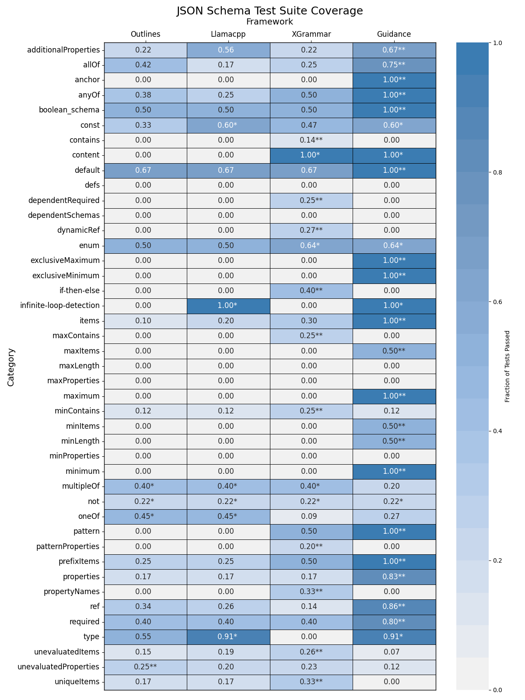
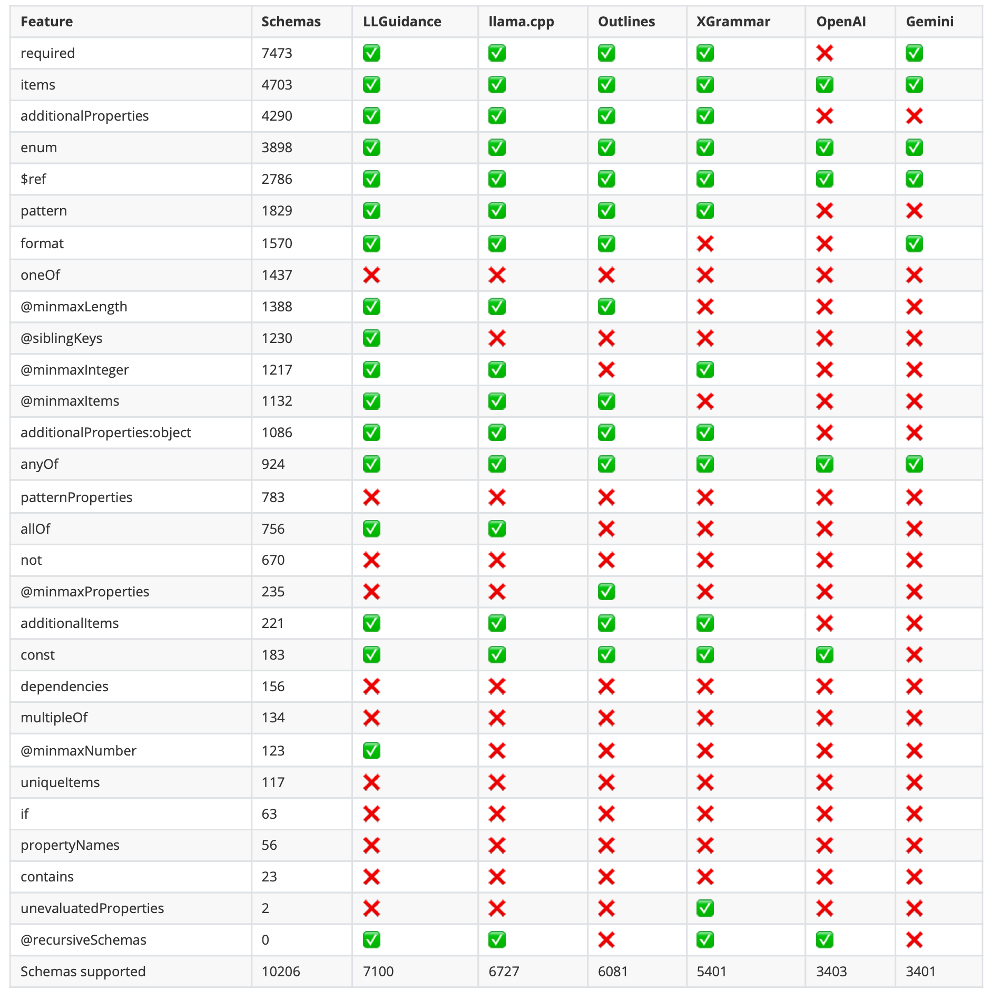

# JSONSchemaBench

[](https://arxiv.org/abs/2501.10868)
[](https://huggingface.co/datasets/epfl-dlab/JSONSchemaBench)

Reliably generating structured outputs is a key capability for modern LLM applications. Despite its growing adoption, a systematic evaluation of structured output generation is still lacking. With JSON Schema emerging as the standard format for structured data, we introduce JSONSchemaBench a benchmark of around 10,000 real-world JSON schemas that capture a wide range of constraints and complexities.
JSONSchemaBench helps to measure **efficiency** and **coverage** of a given structured output engine.

<p align="center">
    
       <br/>
    <em>Figure 1: Comparison across various constrained-decoding frameworks by efficiency (speed of output generation), coverage (support for JSON Schema features), and quality (effects on underlying task accuracy).</em>
</p>

## Installation

To install the library, follow these steps:

1. Create a conda environment:
    ```bash
    conda create -n "jsonschemabench" python=3.12
    conda activate jsonschemabench
    ```

2. Install the core dependencies:
    ```bash
    pip install -r requirements.txt
    ```

3. Install engines libraries:
   ```bash
    # Install OpenAI and Gemini
    pip install openai
    pip install google-generativeai

    # Install Guidance
    pip install git+https://github.com/guidance-ai/guidance.git@514a5eb16b9d29ad824d9357732ba66e5e767642
    
    # Install llama-cpp-python with CUDA support
    CMAKE_ARGS="-DGGML_CUDA=on" pip install git+https://github.com/abetlen/llama-cpp-python.git
    
    # Install Outlines and XGrammar
    pip install git+https://github.com/dottxt-ai/outlines.git
    pip install git+https://github.com/mlc-ai/xgrammar.git
   ```

For GPU acceleration, ensure you have the appropriate CUDA drivers installed on your system.

## Documentation

- **[Quickstart Guide](docs/quickstart.md)**: Learn how to run benchmarks using the CLI or Python API
- **[Custom Engine Tutorial](docs/custom_engine.md)**: Detailed instructions for implementing your own engine

For examples of how to use different engines, check the [tests/all.py](tests/all.py) file.

## 📥 Accessing the Dataset on Hugging Face
JSONSchemaBench is now available on the Hugging Face Hub. You can load it directly using the `datasets` library:

```python
from datasets import load_dataset

dataset = load_dataset("epfl-dlab/JSONSchemaBench")
print(dataset)  
```
Each dataset split contains:
- `"json_schema"`: The schema definition.
- `"unique_id"`: A unique identifier for the schema.

## Dataset Details

JSONSchemaBench is built from a collection of real-world JSON schemas drawn from diverse sources, including GitHub, Kubernetes configurations, and API specifications. The benchmark consists of schemas categorized into datasets based on complexity and domain. We start from collections from [json-schema-corpus](https://github.com/sdbs-uni-p/json-schema-corpus) and did heavy curation to ensure the schemas are standard-compliant and satisfiable. We also added schemas from other sources to increase the diversity of the benchmark, such as [GlaiveAI function call schemas](https://huggingface.co/datasets/glaiveai/glaive-function-calling-v2) and [kubernetes schemas](https://github.com/instrumenta/kubernetes-json-schema).
We then categorized the schemas into datasets based on complexity and domain. The datasets are as follows:

<div align="center">

| Dataset         | Category            | Count |
| --------------- | ------------------- | ----- |
| GlaiveAI-2K     | Function Call       | 1707  |
| Github-Trivial  | Misc                | 444   |
| Github-Easy     | Misc                | 1943  |
| Snowplow        | Operational API     | 403   |
| Github-Medium   | Misc                | 1976  |
| Kubernetes      | Kubernetes API      | 1064  |
| Washington Post | Resource Access API | 125   |
| Github-Hard     | Misc                | 1240  |
| JSONSchemaStore | Misc                | 492   |
| Github-Ultra    | Misc                | 164   |
| **Total**       |                     | 9558  
</div>

For statistics on the datasets and an overview of schema constraint features, please refer to the [paper]()(link coming soon).

<p align="center">
    
    
</p>

## JSON Schema Test Suite

For more details about the JSON Schema Test Suite used in the paper, visit the [official repository]((https://github.com/json-schema-org/JSON-Schema-Test-Suite)). 
The results of the test suite coverage are shown below

<p align="center">
    
</p>

## Feature Checklist

We provide a feature checklist for each Structured Output Generation Engine based on their documentation and implementation. This provides a comprehensive overview of the supported JSON Schema features.

<p align="center">
    
</p>

## Citation

```bibtex
@misc{geng2025jsonschemabench,
      title={Generating Structured Outputs from Language Models: Benchmark and Studies}, 
      author={Saibo Geng and Hudson Cooper and Michał Moskal and Samuel Jenkins and Julian Berman and Nathan Ranchin and Robert West and Eric Horvitz and Harsha Nori},
      year={2025},
      eprint={2501.10868},
      archivePrefix={arXiv},
      primaryClass={cs.CL},
      url={https://arxiv.org/abs/2501.10868}, 
}
```
